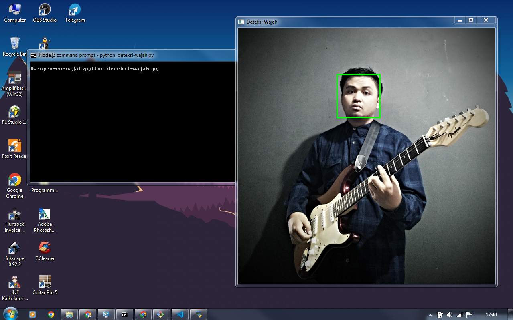

# Aplikasi Deteksi Wajah dengan Python dan OpenCV

Aplikasi sederhana untuk mendeteksi wajah dalam foto JPG menggunakan Python dan OpenCV.

## Prasyarat

Sebelum Anda dapat menjalankan aplikasi ini, pastikan Anda telah menginstal OpenCV. Anda dapat menginstalnya menggunakan pip:

```bash
pip install opencv-python
```

## Cara Menggunakan Aplikasi

1. Pastikan gambar yang ingin Anda deteksi wajahnya sudah ada dalam proyek ini atau Anda dapat mengganti 'gambar.jpg' dengan gambar JPG Anda sendiri.

2. Jalankan aplikasi dengan menjalankan script `deteksi_wajah.py`. Pastikan Anda sudah mengganti nama gambar dan path classifier yang sesuai sesuai dengan kebutuhan Anda.

```bash
python deteksi_wajah.py
```

3. Aplikasi akan mendeteksi wajah dalam gambar dan menampilkan gambar yang telah dimodifikasi dengan kotak di sekitar wajah yang terdeteksi. Gambar yang telah dimodifikasi juga akan disimpan sebagai 'gambar_dengan_wajah.jpg'.

## Kontribusi

Jika Anda ingin berkontribusi pada proyek ini, Anda dapat melakukan fork dan pull request.

## Lisensi

Proyek ini dilisensikan di bawah [Lisensi MIT](LICENSE).
